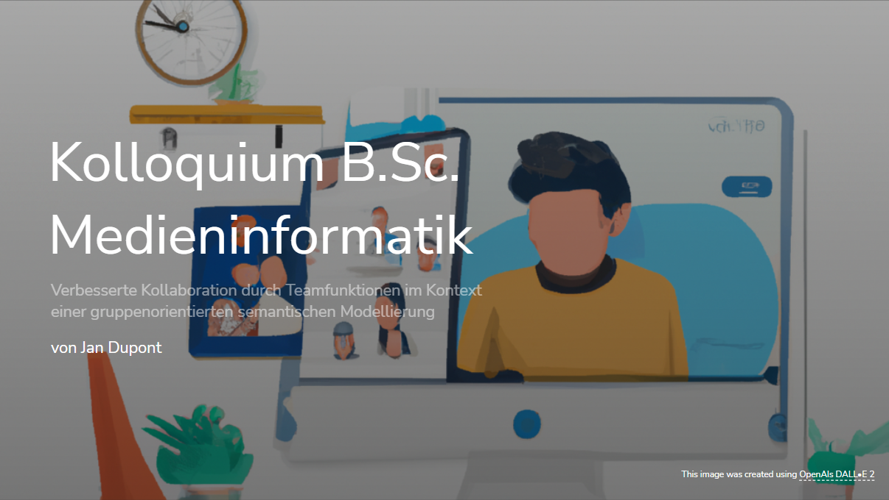

# Presentation for Bachelorthesis Kolloquium

## Todo:

-   [ ] Bilder (Dall-E)
-   [x] Problemstellung
-   [x] Teamfunktionen
-   [ ] Demonstration
-   [x] Implementierung Allgemein
-   [ ] Implementierung Frontend
-   [ ] Implementierung Backend
-   [ ] Fazit

Verbesserte Kollaboration durch Teamfunktionen im Kontext einer gruppenorientierten semantischen Modellierung.

